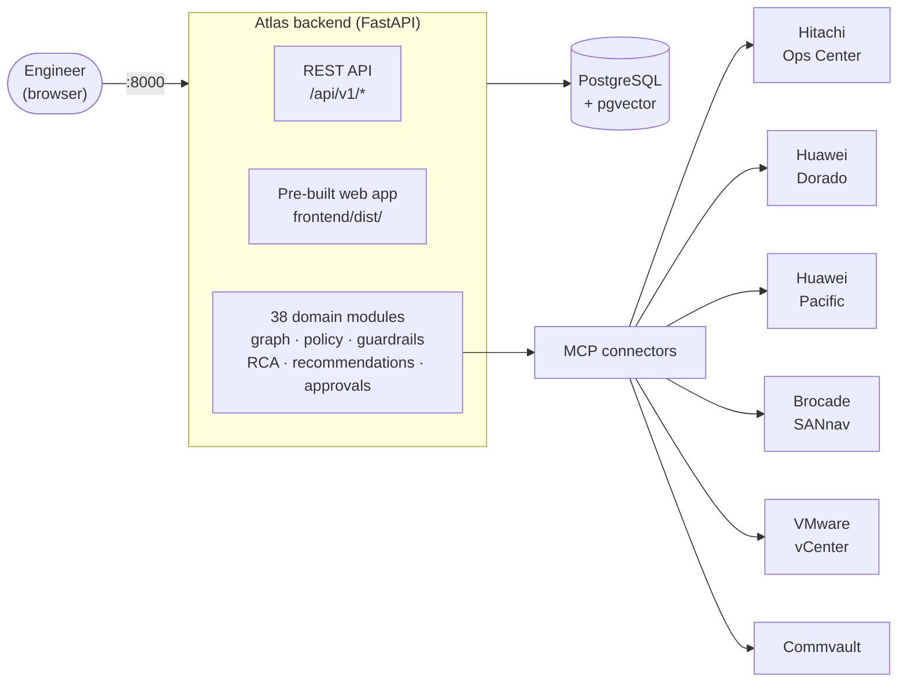

# Project Atlas

**An enterprise AI infrastructure operations platform that explains itself.**

[](https://github.com/ozdemirumit/Project_Atlas/actions/workflows/ci.yml)


Atlas helps infrastructure teams understand complex environments, analyze operational problems,
assess risk, and generate explainable recommendations -- without letting AI perform unauthorized
infrastructure changes. It correlates infrastructure data, vendor knowledge, operational history,
topology, and health checks, then hands every conclusion to a human with the evidence behind it.

> **AI assists. Humans decide.**
> Atlas analyzes, explains, recommends, and prepares plans. It never executes
> infrastructure-changing operations itself -- approved plans are carried out through external,
> human-governed organizational processes.

## Contents

- [What Atlas is](#what-atlas-is)
- [Architecture at a glance](#architecture-at-a-glance)
- [Design principles](#design-principles)
- [Roadmap](#roadmap)
- [Development status](#development-status)
- [Repository structure](#repository-structure)
- [Getting started](#getting-started)
  - [Deploy anywhere](#deploy-anywhere)
  - [Configuration](#configuration)
  - [Going to production](#going-to-production)
  - [Local development, with hot reload](#local-development-with-hot-reload)
- [Contributing](#contributing)

## What Atlas is

Modern enterprise infrastructure spans storage systems, SAN switches, virtualization platforms,
operating systems, backup platforms, directory services, network services, and vendor-specific
tools -- usually managed through separate consoles, APIs, scripts, runbooks, and tribal knowledge.

Atlas unifies that operational picture through modular MCP connectors, an infrastructure knowledge
graph, retrieval-augmented generation, AI agents, policy controls, and enterprise governance, so
engineers can investigate incidents, understand blast radius, and prepare safe remediation plans
from one place. It is not a monitoring tool and not an autonomous operator -- it is a
decision-support platform, built enterprise-first: identity integration, RBAC, LDAP/Active
Directory, audit logging, Syslog, SIEM, explainability, and approval workflows are core
requirements from day one, not later additions.

| | |
| --- | --- |
| **Documentation baseline** | 47 governed documents, all version `1.0.0`, all `Approved` |
| **Backend** | 38 domain modules -- identity/RBAC, knowledge graph, policy engine, guardrails, RCA, recommendations, change impact, runbook engine, approvals, audit ledger, RAG knowledge base |
| **Vendor connectors** | 6, each against the vendor's real API -- Hitachi Ops Center, Huawei Dorado, Huawei Pacific, Brocade SANnav, VMware vCenter, Commvault |
| **Frontend** | React web application, pre-built and served by the backend |
| **Tests** | 850+ backend test files, checked with `ruff`, `mypy`, and `pytest` on every change and in CI |
| **Deployment** | One script, no Docker, no containers, no YAML anywhere in the path |

## Architecture at a glance



The backend is a single deployable process: it serves the REST API, the pre-built web application,
and reaches every vendor system exclusively through read-oriented MCP connectors -- there is no
path from Atlas to an infrastructure-changing operation.

## Design principles

These are architectural constraints for the whole project, not aspirations.

| Principle | What it means |
| --- | --- |
| **AI assists, humans decide** | Atlas may analyze, explain, recommend, and prepare plans. It must not perform operationally risky or infrastructure-changing actions. Approval never converts a recommendation into Atlas execution authority. |
| **Explainability first** | Every recommendation carries evidence, reasoning, confidence, risk, expected impact, assumptions, and alternatives. |
| **Enterprise first** | Identity integration, RBAC, auditability, logging, approval workflows, high availability, and operational governance are designed in from day one. |
| **Vendor agnostic** | No dependency on a single vendor ecosystem -- infrastructure capabilities are integrated through modular MCP connectors. |
| **Modular by design** | Connectors, AI agents, health checks, workflows, policies, reports, knowledge sources, and UI modules are independently replaceable and versioned. |
| **Security by default** | Secure defaults, least privilege, protected secrets, auditable actions, and safe failure behavior are mandatory, not opt-in. |
| **Reproducible from the repository** | Everything needed to build, test, validate, and deploy Atlas is documented and automated from this repository, including for enterprise and restricted-network environments. |

## Roadmap

The documentation baseline below is complete (47/47 documents `Approved`); implementation against
it is ongoing and tracked task-by-task in
[`docs/implementation/IMPLEMENTATION_TRACKER.md`](docs/implementation/IMPLEMENTATION_TRACKER.md).

| Phase | Focus |
| --- | --- |
| 1 -- Product Definition | Product vision, requirements, principles, shared terminology |
| 2 -- Architecture | System, component, service, deployment, AI, RAG, and event architecture |
| 3 -- Core Platform | MCP framework and SDK, MCP Builder, workflow, decision, policy, graph, and knowledge engines |
| 4 -- Enterprise | Authentication, RBAC, audit, logging, Syslog, SIEM, ITSM, approval, deployment, and bootstrap controls |
| 5 -- AI | Agents, reasoning, root cause analysis, recommendations, change impact, runbook intelligence, explainability, guardrails |
| 6 -- Development | API, backend, frontend, databases, coding standards, testing, deployment, CI/CD, release practices |
| 7 -- AI Development Control | The master operating prompt and control protocol for AI-assisted development |

## Development status

**Core platform implemented and passing continuous verification.**

The backend is a runnable modular monolith of 38 domain modules (`backend/src/atlas/modules/`),
including identity and RBAC, LDAP/Active Directory integration, the infrastructure knowledge
graph, policy engine, guardrails, explainability, root cause analysis, recommendations, change
impact, runbook engine, approval workflows with ITSM binding, notifications, audit logging with a
hash-chained integrity ledger, and a retrieval-augmented knowledge base. Six vendor MCP connectors
are implemented against each vendor's real API (`mcp/connectors/`). The web application
(`frontend/`) and the automated deployment path (see [Getting Started](#getting-started)) are both
real and runnable end to end. The backend carries an extensive automated test suite (850+ test
files) run with `ruff`, `mypy`, and `pytest` on every change and in CI.

Every implementation task is recorded in
[`docs/implementation/IMPLEMENTATION_TRACKER.md`](docs/implementation/IMPLEMENTATION_TRACKER.md),
the authoritative source for what is built, in progress, or deliberately deferred. Items currently
deferred by explicit, on-record decision rather than oversight:

- The composition of a single guardrails/pipeline architecture across several already-built
  modules -- an open product question, not a missing feature.
- The MCP Builder's manual-change tracking and regeneration workflow.
- The `infrastructure/` implementation track, an intentional placeholder pending a dedicated
  implementation request.

## Repository structure

```text
AGENTS.md          AI development rules for Codex, Claude Code, and similar agents
docs/              Product, architecture, platform, security, AI, and development documents
backend/           Backend API and all domain modules (identity, graph, policy, RCA, ...)
frontend/          Enterprise React web application (frontend/dist/ ships pre-built)
mcp/connectors/    Real vendor MCP connector packages (Hitachi, Huawei, Brocade, vCenter, Commvault)
scripts/           Deployment and local development automation
tests/             Cross-cutting test suites and validation assets
agents/            Placeholder for standalone AI agent orchestration (not yet implemented)
knowledge/         Placeholder for repository-level knowledge assets (not yet implemented)
workflows/         Placeholder for repository-level workflow assets (not yet implemented)
infrastructure/    Placeholder for deployment/platform infrastructure (not yet implemented)
```

Each top-level directory contains a short README that defines its ownership and current status.
`agents/`, `knowledge/`, `workflows/`, and `infrastructure/` are intentional placeholders reserved
by their governing documents -- the working equivalents of AI orchestration, RAG, and health-check
logic already exist today inside `backend/src/atlas/modules/`.

## Getting started

Everything needed to build, run, and deploy Atlas ships in this repository -- there is nothing to
fetch from anywhere else except PostgreSQL itself. Cloning the repository and running one script
is enough to bring Atlas up in a new environment. There is no Docker, no containers, and no YAML
anywhere in the deployment path -- `scripts/install` runs a single backend process, no Node.js or
package registry access required.

The frontend ships pre-built as static files at `frontend/dist/`, served directly by the backend
on the same port -- a deployment target needs no Node.js, npm, or pnpm of its own. See
[Contributing](#contributing) for how to rebuild `frontend/dist/` after a frontend source change.

### Deploy anywhere

`scripts/install` installs almost everything it needs itself -- there is nothing to set up by
hand beforehand on most platforms:

- **`uv`** is installed automatically if missing, using its official installer (user-local, no
  administrator/root privileges needed).
- **PostgreSQL 18 with [pgvector](https://github.com/pgvector/pgvector)**, if `psql` isn't already
  found:
  - **macOS**: installed automatically with Homebrew (`brew install postgresql@18 pgvector`),
    after a one-line confirmation.
  - **Debian/Ubuntu**: installed automatically via the official PGDG apt repository, after a
    one-line confirmation (needs `sudo`).
  - **Windows**: the script launches the PostgreSQL installer for you via `winget`. pgvector
    ships no binary distribution for Windows at all -- only a source build is possible -- so the
    script also installs Visual Studio C++ Build Tools automatically if needed (several GB,
    several minutes) and builds pgvector from source. This requires an elevated (Administrator)
    PowerShell session; re-run as Administrator if it stops with a permissions error. If your
    network blocks the download (some corporate proxies block `.exe`/binary downloads by policy),
    obtain `vs_buildtools.exe` and the pgvector source zip through an approved channel yourself
    and pass their paths: `./scripts/install.ps1 -VcBuildToolsInstaller <path> -PgVectorArchive
    <path>`.
  - **Other Linux distributions**: no safe auto-install path is wired up; install PostgreSQL and
    pgvector yourself via your distribution's package manager (see the
    [pgvector installation notes](https://github.com/pgvector/pgvector#installation)) and re-run.

```bash
git clone https://github.com/ozdemirumit/Project_Atlas.git
cd Project_Atlas
scripts/install.sh          # Linux, macOS, or WSL
```

```powershell
scripts\install.cmd         # Windows, no PowerShell execution-policy change required
# or: .\scripts\install.ps1
```

The installer first makes sure `uv` and PostgreSQL are present (installing whichever are missing,
as described above), creates `.env` from `.env.example` with a freshly generated database
password if `.env` does not already exist, then -- the first time it cannot already connect as the
`atlas` role -- sets up the `atlas` role, `atlas` database, and `vector` extension. When the
installer just installed PostgreSQL itself (macOS/Debian/Ubuntu), this happens automatically with
no prompt; otherwise it prompts once for your existing PostgreSQL server's superuser credentials.
It then installs backend dependencies, runs database migrations, and starts the backend as a
background process (which also serves the pre-built frontend), waiting for it to report healthy.
Re-running `scripts/install` is safe: it skips already-installed prerequisites and the superuser
step once the `atlas` role is reachable, and only reinstalls dependencies and restarts the process.

Open `http://localhost:8000` -- the backend serves both the web application and the API from the
same port, with interactive API documentation at `http://localhost:8000/docs`.

Verify it came up healthy:

```bash
curl http://localhost:8000/health/ready       # backend readiness check
tail -f .atlas/backend.log
```

Stop everything the installer started:

```bash
scripts/uninstall.sh              # Linux, macOS, or WSL
scripts/uninstall.sh --purge      # also drops the atlas database and role
```

```powershell
scripts\uninstall.cmd             # Windows
.\scripts\uninstall.ps1 -Purge    # also drops the atlas database and role
```

For routine day-to-day process control after that first install (e.g. restarting after a server
reboot), use the lighter `scripts/start`/`scripts/stop` instead -- they skip dependency
installation, PostgreSQL setup, and migrations, and just start or stop the already-installed
backend:

```bash
scripts/start.sh                  # Linux, macOS, or WSL
scripts/stop.sh
```

```powershell
scripts\start.cmd                 # Windows
scripts\stop.cmd
```

To pull the latest code and apply it -- stop, `git pull --ff-only`, then re-run `install` (not
just `start`, so any new dependency or migration the pull brought in is actually applied) -- use
`scripts/update` instead of doing those steps by hand:

```bash
scripts/update.sh                 # Linux, macOS, or WSL
```

```powershell
scripts\update.cmd                # Windows
```

It refuses to run if a tracked file has uncommitted changes, and refuses the pull itself if the local branch
has diverged from its remote tracking branch.

### Configuration

All runtime configuration lives in `.env`, which `scripts/install` creates from `.env.example` on
first run (see `.env.example` for the full, commented list). Every variable is prefixed `ATLAS_`.
`ATLAS_POSTGRES_HOST` and `ATLAS_POSTGRES_PORT` (defaulting to `localhost`/`5432`) and
`ATLAS_POSTGRES_PASSWORD` are read by `scripts/install` itself to reach PostgreSQL and to build
`ATLAS_DATABASE_URL` for the backend; every other variable is read directly by the backend. Four
of them (`ATLAS_ENVIRONMENT`, `ATLAS_DATABASE_REQUIRED`, `ATLAS_DATABASE_URL`,
`ATLAS_DEVELOPMENT_IDENTITY_ENABLED`) are always set explicitly by `scripts/install` when it
starts the backend process, overriding whatever `.env` itself says for them.

| Variable | Purpose | Default |
| --- | --- | --- |
| `ATLAS_POSTGRES_HOST` | Hostname of the PostgreSQL server. Read only by `scripts/install`. | `localhost` |
| `ATLAS_POSTGRES_PORT` | Port of the PostgreSQL server. Read only by `scripts/install`. | `5432` |
| `ATLAS_POSTGRES_PASSWORD` | Password for the `atlas` PostgreSQL role. Generated automatically on first install. | *(generated)* |
| `ATLAS_DEVELOPMENT_IDENTITY_ENABLED` | Enables the built-in `Local Operator` identity for local testing. Disabled by default outside the installer/dev scripts; never enable in production. | `false` |
| `ATLAS_LOCAL_MODEL_ENABLED` | Enables governed invocation of a real, on-prem/local LLM gateway. Requires the three variables below when `true`, or the backend refuses to start. | `false` |
| `ATLAS_LOCAL_MODEL_BASE_URL` | Base URL of an OpenAI-compatible `/v1` chat-completions endpoint. | *(unset)* |
| `ATLAS_LOCAL_MODEL_ID` | Model identifier passed to the gateway. | *(unset)* |
| `ATLAS_LOCAL_MODEL_READER_TOKEN` | Bearer token for the gateway. Never commit a real value -- set it only in your own untracked `.env`. | *(unset)* |
| `ATLAS_DIRECTORY_IDENTITY_ENABLED` | Enables enterprise LDAP/Active Directory authentication. | `false` |
| `ATLAS_DIRECTORY_ENDPOINTS` | JSON array of LDAPS endpoint URLs. | `[]` |
| `ATLAS_DIRECTORY_CA_CERTIFICATE_FILE` | Filesystem path to the directory server's CA certificate, read directly by the backend process. | *(unset)* |
| `ATLAS_DIRECTORY_USER_PRINCIPAL_TEMPLATE` | Template used to build a user's bind principal, with `{username}` substituted. | `{username}@example.internal` |
| `ATLAS_DIRECTORY_USER_SEARCH_BASE` | LDAP search base for user lookups. | `OU=People,DC=example,DC=internal` |
| `ATLAS_DIRECTORY_USER_SEARCH_FILTER` | LDAP search filter, with `{username}` substituted. | `(&(objectClass=user)(sAMAccountName={username}))` |
| `ATLAS_DIRECTORY_GROUP_MAPPINGS` | JSON array mapping directory groups to Atlas roles. No directory password or bind secret belongs in this file. | `[]` |
| `ATLAS_WORKFLOW_TRANSPORT_CREDENTIAL_ASSIGNMENTS` | JSON array of secret-free deployment credential-assignment metadata. Passwords, tokens, private keys, certificates, vault paths, and retrievable secret references are prohibited here. | `[]` |
| `ATLAS_SESSION_COOKIE_NAME` | Name of the browser session cookie. | `atlas_session` |
| `ATLAS_CSRF_COOKIE_NAME` | Name of the CSRF cookie. | `atlas_csrf` |
| `ATLAS_CSRF_HEADER_NAME` | Header clients must echo the CSRF token in. | `X-CSRF-Token` |
| `ATLAS_SESSION_ABSOLUTE_TIMEOUT_MINUTES` | Maximum session lifetime regardless of activity (5-1440). | `480` |
| `ATLAS_SESSION_IDLE_TIMEOUT_MINUTES` | Session expiry after inactivity (1-240). | `30` |
| `ATLAS_SESSION_MAX_PER_SUBJECT` | Maximum concurrent sessions per identity (1-20). | `5` |
| `ATLAS_API_CREDENTIAL_MAX_LIFETIME_MINUTES` | Maximum lifetime of an issued API credential (5-60). | `60` |
| `ATLAS_API_CREDENTIAL_MAX_ACTIVE_PER_SUBJECT` | Maximum concurrent active API credentials per identity (1-20). | `10` |
| `ATLAS_PROTECTED_CONTENT_ENCRYPTION_KEY_B64` | Base64-encoded 32-byte AES-256-GCM key backing the encrypted-content-at-rest store: document-sourced knowledge and the self-built connector-credential vault (see "Going to production" below). | *(unset)* |

The backend process reads `.env` itself via its own settings loader, regardless of which script
starts it, and that loader strips matching quotes, so both quoted and unquoted values work.

### Going to production

`ATLAS_ENVIRONMENT=production` turns on a real, already-enforced validator
(`enforce_production_security_defaults` in `backend/src/atlas/core/config.py`) that fails closed
rather than silently degrading: it requires `ATLAS_DATABASE_REQUIRED=true`, forbids
`ATLAS_DEVELOPMENT_IDENTITY_ENABLED=true`, forbids enabling development and directory identity
together, requires a complete real LDAPS profile if directory identity is enabled, and forbids
`ATLAS_ENABLE_API_DOCS=true`. Two more steps make the *safe* path actually usable in production,
closing what were previously the only two development-only gaps:

1. **A durable administrator account with real, durable permissions.** Run the bootstrap script
   once, on the server:

   ```bash
   scripts/bootstrap_admin.sh    # Linux, macOS, WSL
   scripts/bootstrap_admin.cmd   # Windows Command Prompt
   # or: .\scripts\bootstrap_admin.ps1
   ```

   It prompts for a subject id, display name, one of three LOCAL-reachable role tiers
   (`role.local-administrator` / `role.local-operator` / `role.local-monitor` -- day-to-day
   operational access without governance/RBAC-management permissions, and read-only,
   respectively; `role.security-administrator` is deliberately reserved for enterprise
   LDAP/OIDC/SAML identities and cannot be used here), a temporary bootstrap password, and a
   separate final password. ATLAS-030 requires the bootstrap password be replaced before the
   account's real role applies, so the script replaces it and durably grants the chosen tier in
   the same run -- the account is active and ready to sign in with the final password as soon as
   the script finishes. There is deliberately no HTTP endpoint for this first step -- only
   someone who already has shell access to the server can create the first account. Once it
   exists, grant further accounts any of the three tiers directly from the running application:
   `POST /api/v1/authorization/role-assignments`.

2. **A real connector-credential vault.** Set `ATLAS_PROTECTED_CONTENT_ENCRYPTION_KEY_B64` (see
   the table above) before starting the backend. With it set, every bundled connector's connection
   dialog lets you type that vendor's plain username and password directly -- Atlas encodes them
   the way that specific vendor's API expects (a pre-built Basic-auth header for Brocade SANnav
   and Hitachi Ops Center; a raw, unencoded pair for vCenter, Huawei OceanStor Dorado/Pacific, and
   Commvault, each of which owns its own login/session exchange) before storing the result
   AES-256-GCM-encrypted in PostgreSQL -- the self-built vault this project uses instead of an
   external secret manager or a hand-set OS environment variable. Losing this key makes everything
   it encrypted permanently unrecoverable, so back it up outside the database.

### Local development, with hot reload

Prerequisites:

- Python 3.12
- uv 0.12.1
- Node.js 24
- pnpm 11.7.0

Unlike `scripts/install`, these scripts run the backend and frontend in the foreground with live
reload, for active development, and default to synthetic mode
(`ATLAS_DATABASE_REQUIRED=false`) unless `.env` points `ATLAS_DATABASE_URL` at a real database.

For direct local development on Windows without changing PowerShell execution policy:

```bat
scripts\bootstrap.cmd
scripts\dev.cmd
```

Open `http://localhost:5173`. The API is available at `http://localhost:8000`, with interactive
development documentation at `http://localhost:8000/docs`.

```powershell
curl http://localhost:8000/health/ready    # backend readiness check
```

The supported development launcher explicitly enables a local, server-configured identity named
`Local Operator`. This identity is disabled by default, cannot run in production, and has only the
C0 permission required to read its own identity context. It is not an administrator account.

Run all repository quality checks with:

```bat
scripts\check.cmd
```

Equivalent PowerShell scripts remain available for environments where signed or local scripts
are permitted. Do not disable antivirus or lower organizational security controls for Atlas.

Contributors should read:

- `AGENTS.md`
- `docs/README.md`
- `docs/001_Product_Vision.md`
- `docs/002_Product_Requirements.md`
- `docs/003_Project_Principles.md`
- `docs/060_Master_Prompt.md`
- `docs/implementation/IMPLEMENTATION_TRACKER.md`
- `docs/adr/README.md`

## Contributing

See [`CONTRIBUTING.md`](CONTRIBUTING.md) for the documentation lifecycle, review and approval
workflow, versioning policy, and pull request expectations.

- Start implementation only through a scoped task governed by the accepted documents.
- Do not commit secrets, credentials, IP addresses, customer names, or real infrastructure details.
- Keep changes scoped to the assigned task.
- Preserve the principle that AI assists and humans decide.
- Update documentation when decisions change.

### Updating the pre-built frontend

`frontend/dist/` is committed so `scripts/install` never needs Node.js/npm/pnpm or npm registry
access on the deployment target -- it is the one intentional exception to this repository's
"no build output committed" rule (see `.gitignore`). After any change under `frontend/src/`,
rebuild and commit it:

```bash
cd frontend
pnpm install --frozen-lockfile
pnpm build
git add dist
```
