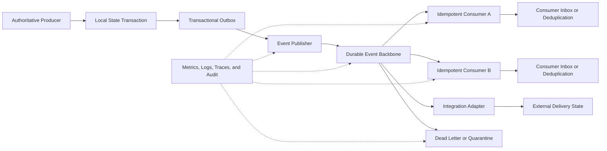

# Project Atlas

## Event Architecture

| Field | Value |
| --- | --- |
| Document ID | ATLAS-016 |
| Version | 1.0.0 |
| Status | Approved |
| Document Owner | Architecture Owner |
| Reviewers | Backend Architecture, Security Architecture, Platform Engineering, Data Governance, Operations |
| Approver | Umit Ozdemir (acting Architecture Owner) |
| Approval Date | 2026-08-03 |
| Last Updated | 2026-08-03 |
| Related Documents | [ATLAS-003](003_Project_Principles.md), [ATLAS-004](004_Glossary.md), [ATLAS-010](010_System_Architecture.md), [ATLAS-011](011_Component_Architecture.md), [ATLAS-012](012_Microservice_Architecture.md), [ATLAS-032](032_Audit.md) |
| Supersedes | ATLAS-016 version 0.1.0 |

## 1. Purpose

This document defines how Project Atlas represents, publishes, transports, consumes, retains, replays, secures, observes, and evolves events.

Events support decoupled reactions and durable operational history. They do not replace commands, workflow state, audit records, or transactional systems of record.

## 2. Scope

### In Scope

- Event terminology and taxonomy
- Canonical event envelope
- Producer, consumer, topic, and ownership rules
- Delivery, ordering, idempotency, replay, and failure behavior
- Schema governance and compatibility
- Security, data classification, audit, and observability
- MVP event backbone and evolution

### Out of Scope

- Final message-broker selection
- Complete field-level schemas for every event
- Workflow definition format
- Syslog wire-format details
- Metrics and application-log schemas

## 3. Terminology Boundaries

| Record type | Meaning | Mutability and response |
| --- | --- | --- |
| Command | Request for an owner to attempt an action | May be accepted or rejected; not a completed fact |
| Domain event | Statement that a domain fact occurred | Immutable; consumers react independently |
| Integration event | Stable event published for another bounded context or external system | Immutable, minimized, versioned public contract |
| Workflow state | Authoritative current and historical process state | Owned by Workflow Orchestrator |
| Audit event | Accountability record for security or operational governance | Append-oriented and separately retained |
| Operational log | Diagnostic record for platform support | Not an authoritative business or audit record |
| Metric | Numeric observation over time | Aggregated operational signal |

An event name must describe a completed fact in past tense. Examples: `ConnectorCapabilityCompleted`, `ApprovalGranted`, and `KnowledgeItemPublished`.

## 4. Event Principles

1. A domain event has one authoritative producer.
2. Events describe facts; they do not contain hidden imperative instructions.
3. Producers publish only after the owned state transition commits.
4. Delivery is at least once unless a narrower contract is proven.
5. Consumers are idempotent and tolerate duplicate, delayed, and out-of-order events.
6. Schemas are versioned and backward compatibility is governed.
7. Payloads are minimized and carry classification metadata.
8. Correlation and causation are preserved end to end.
9. Replay is controlled, observable, authorized, and isolated from ordinary live processing where needed.
10. Audit and workflow truth do not depend solely on a best-effort event stream.

## 5. Event Flow



## 6. Canonical Event Envelope

Every Atlas domain and integration event uses a versioned envelope.

| Field | Required | Description |
| --- | --- | --- |
| `event_id` | Yes | Globally unique immutable event identifier |
| `event_type` | Yes | Stable event name in past tense |
| `event_version` | Yes | Schema version for type and payload |
| `occurred_at` | Yes | Producer time when the fact occurred, in UTC |
| `recorded_at` | Yes | Time Atlas persisted or received the event, in UTC |
| `producer` | Yes | Authoritative component and version |
| `subject_type` | Yes | Type of primary entity or process |
| `subject_id` | Yes | Stable scoped subject identifier |
| `organization_id` | Conditional | Organizational or tenant boundary where applicable |
| `environment_id` | Conditional | Development, lab, staging, or production scope |
| `correlation_id` | Yes | End-to-end request or workflow correlation |
| `causation_id` | Conditional | Command or event that directly caused this event |
| `workflow_id` | Conditional | Workflow run reference |
| `actor` | Conditional | Human and service identity references where policy permits |
| `classification` | Yes | Data classification and handling label |
| `schema_uri` | Recommended | Resolvable schema identifier |
| `trace_context` | Conditional | Distributed trace propagation fields |
| `payload` | Yes | Event-specific, minimized structured data |
| `extensions` | Optional | Namespaced backward-compatible metadata |

Identifiers are references, not secrets. Event payloads must not contain passwords, private keys, bearer tokens, unrestricted session tokens, or raw credential material.

## 7. Event Naming

Canonical naming format:

```text
<Domain><Subject><PastTenseOutcome>
```

Examples:

- `IdentityAuthenticationSucceeded`
- `IdentityAuthenticationFailed`
- `AuthorizationAccessDenied`
- `ConnectorPackageRegistered`
- `ConnectorCapabilityStarted`
- `ConnectorCapabilityCompleted`
- `ConnectorCapabilityFailed`
- `WorkflowRunWaitingForApproval`
- `ApprovalRequestCreated`
- `ApprovalGranted`
- `KnowledgeItemPublished`
- `InventoryEntityObserved`
- `GraphRelationshipExpired`
- `AIRecommendationGenerated`
- `ReportArtifactCreated`

Names do not encode transport topic, vendor, environment, or schema version unless those are part of the domain meaning.

## 8. Event Taxonomy

### 8.1 Identity and Access

- Authentication success, failure, lockout, session creation, expiry, and revocation
- Authorization allow and deny where audit or downstream reaction requires it
- Role, group mapping, and permission changes

### 8.2 Connector and Capability

- Package registration, validation, enablement, disablement, upgrade, and retirement
- Connector instance health and configuration state
- Capability requested, started, completed, failed, timed out, cancelled, or left uncertain

### 8.3 Inventory and Graph

- Entity observed, reconciled, changed, missing, retired, or conflicted
- Relationship observed, changed, expired, or removed
- Discovery run lifecycle

### 8.4 Knowledge and RAG

- Source registered, synchronized, degraded, suspended, or retired
- Item acquired, quarantined, parsed, indexed, published, superseded, or deleted
- Evaluation completed and index version activated

### 8.5 Workflow and Approval

- Workflow scheduled, started, paused, resumed, waiting, completed, failed, cancelled, compensating, or recovery-required
- Approval requested, granted, rejected, deferred, expired, cancelled, or more-evidence-required

### 8.6 AI and Decision Support

- Agent run started, completed, failed, cancelled, or budget-exhausted
- Model endpoint degraded or suspended
- Recommendation generated, superseded, reviewed, or rejected
- Guardrail triggered and output validation failed

### 8.7 Platform and Integration

- Report requested, generated, delivered, failed, or expired
- ITSM, SIEM, Syslog, CMDB, or notification delivery outcomes
- Configuration and policy activation outcomes
- Backup, restore, upgrade, and migration lifecycle where required

## 9. Producer Ownership

Each event type has one authoritative owning component.

The owner defines:

- Business meaning
- Triggering state transition
- Envelope and payload schema
- Compatibility and retention expectations
- Privacy and classification
- Expected ordering key
- Authoritative source reference
- Tests and operational support

Other components cannot publish an event that claims another component's authoritative state change. They may publish a separate observation or integration event in their own namespace.

## 10. Publication Reliability

### 10.1 Transactional Outbox

When an event represents a committed local state transition, the producer writes state and an outbox record in the same local transaction. A publisher forwards the outbox record to the event backbone.

The initial workflow implementation uses an immutable, provider-neutral `pending_publication`
entry created atomically with dispatch-intent staging. This entry is durable publication input only;
it contains no broker address, topic, routing key, delivery receipt, dispatch claim or execution
authority. Before a provider adapter may attempt publication, a dedicated workload publisher must
hold a bounded, durable lease for the exact pending entry. The lease uses an independent,
monotonically increasing publication fencing token and revalidates the current source orchestration
lease. Lease ownership contains no transport configuration and grants no publication, delivery,
dispatch or execution authority. Broker selection and publication lifecycle evidence remain
separate later boundaries.

While holding that exact active lease, the publisher may durably prepare one immutable canonical
`WorkflowStepDispatchRequested` envelope for the pending entry. Preparation binds the exact outbox,
source orchestration lease and publication lease, but remains provider-neutral. It selects no
broker or route, creates no wire serialization or transport attempt, and grants no publication,
delivery, dispatch or execution authority. Transport admission and publication lifecycle evidence
remain separate later boundaries.

Before any provider, route or wire representation can be selected, the same publisher may record
one immutable provider-neutral transport-admission decision for the exact prepared envelope under
the current publication lease. Admission evaluates a code-owned policy covering the exact event
type/version, schema, classification, canonical representation contract and maximum byte count.
The decision contains no broker, endpoint, topic, routing key, credential, serialized artifact,
publication attempt or receipt and grants no publication, delivery, dispatch or execution authority.
Provider selection, wire serialization and publication lifecycle evidence remain later boundaries.

After admission, the same publisher may deterministically materialize one immutable
provider-neutral UTF-8 canonical JSON byte artifact for the exact envelope. Materialization verifies
the admitted byte count and policy maximum, records a SHA-256 content digest and preserves exact
event, admission, outbox, workflow and lease lineage. Raw bytes remain server-side. No provider,
route, credential or provider message is selected, no network call or publication attempt occurs,
and no publication, delivery, dispatch or execution authority is granted. Provider and route
selection and publication lifecycle evidence remain later boundaries.

The same publisher may next bind the exact artifact to the code-owned
`channel.workflow-dispatch.internal` logical publication contract. The binding freezes domain,
classification, durable at-least-once delivery, workflow-run ordering, workflow-operational
retention and maximum-size requirements while preserving exact artifact, event, workflow, scope
and lease lineage. It selects no physical provider, broker, endpoint, topic, stream, queue,
partition, routing key or credential, makes no network call and grants no publication, delivery,
dispatch or execution authority. Physical transport profiles and publication lifecycle evidence
remain later boundaries.

Independently of any workflow event, a dedicated deployment-control workload may snapshot one
exact active transport capability profile supplied by server-owned deployment configuration. The
immutable snapshot records normalized implementation, adapter-contract, scope and declared
event-contract, representation, classification, delivery, durability, ordering, retention and
maximum-size capabilities. It contains no event or lease lineage, route, destination, endpoint,
credential, secret reference or network-health result. Snapshotting makes no network call, proves
no compatibility or readiness, selects no route and grants no publication, delivery, dispatch or
execution authority. Logical-binding/profile compatibility admission and physical route binding
remain separate later boundaries.

A dedicated compatibility-admitter may next compare one exact bound logical-channel record with
one exact snapshotted deployment transport profile under a versioned code-owned policy. The
immutable admission records only matching event-contract, representation, encoding, delivery,
durability, ordering, retention and maximum-size evidence. It selects no endpoint or route, uses no
credential, performs no network call, proves no profile currency or runtime readiness and grants no
route-selection, publication, delivery, dispatch or execution authority. Physical route binding
and publication lifecycle evidence remain later boundaries.

Independently of workflow events, a dedicated deployment-control workload may next snapshot one
exact active physical route revision from server-owned configuration. The immutable snapshot
records transport/profile/resource/adapter lineage, opaque endpoint-set, destination and
routing-contract references, and versioned credential-requirement, transport-security and network
policy evidence. It exposes no raw locator or field-level locator fingerprint, selects no
credential, makes no network call, proves no readiness and grants no endpoint-resolution,
route-selection, route-binding, credential, network, publication, delivery, dispatch or execution
authority. Workflow route binding, credential/readiness verification and publication remain later
boundaries.

The next immutable boundary binds one exact logical channel, compatibility admission, transport
profile snapshot and physical route snapshot. The minimal binding stores source identities and
digests rather than copying route metadata, validates the chain atomically and grants no endpoint,
credential, network, readiness, publication, delivery, dispatch or execution authority.

Before endpoint resolution, a dedicated freshness-admitter next compares that exact physical
binding and route snapshot with the deployment registry's authoritative unique current-selection
head. The append-only admission records a bounded `valid_until`, monotonic head generation and
fencing digest, but no endpoint, credential or runtime material. Ambiguity, drift, expiry,
suspension, withdrawal or supersession fails closed. Admission grants no endpoint-resolution,
route-selection, route-binding, credential, network, readiness, publication, delivery, dispatch or
execution authority. A future resolver must use a separate workload boundary and revalidate both
the admission lifetime and exact current-head fencing evidence immediately before resolution.

Before endpoint materialization, a dedicated endpoint-resolver workload must then obtain one
non-transferable authorization lease for itself. The lease transaction revalidates the exact
binding, route snapshot, freshness admission and authoritative current-head fence at database time.
Its code-owned lifetime is exactly 15 seconds and cannot exceed the freshness window. The lease
contains no raw endpoint or credential material and grants only endpoint-resolution authority;
route selection, binding, credential, network, readiness, publication, delivery, dispatch and
execution authority remain false. A later materializer must consume the lease once while repeating
the time and fence checks.

Endpoint materialization uses a two-phase crash-safe boundary. PostgreSQL first locks binding,
route snapshot, current head, freshness admission and lease in fixed order, evaluates
`clock_timestamp()` and atomically commits one append-only consumption claim plus started attempt.
That commit is the point of no return. Only then may the trusted materializer resolve sealed
deployment-owned coordinates and write a short-lived encrypted protected artifact outside ordinary
application persistence. Success or known failure is appended separately; claim-without-result is
outcome-uncertain and never retried automatically. Ordinary events, APIs, audit and UI receive only
minimized metadata and no endpoint, artifact access, credential, network, readiness, publication,
delivery, dispatch or execution authority.

Credential requirements do not identify an authoritative credential assignment. Before any
workflow credential binding or access authorization, a dedicated deployment-control workload
therefore snapshots one exact active physical-transport credential-assignment revision. The
immutable snapshot proves route, credential-requirement, authentication-mechanism, principal,
least-privilege, rotation and broker-policy lineage without storing a username, retrievable secret
reference or credential material. It is historical deployment evidence only: it binds no workflow
or protected endpoint artifact, performs no secret-store or network operation and grants no
credential, readiness, publication, delivery, dispatch or execution authority. A later boundary
must independently bind the exact snapshot to workflow lineage and revalidate current rotation,
expiry and revocation state before considering credential-access authorization.

Snapshot history is queried directly by exact scope and remains visible after deployment source
rotation or removal. Exact idempotent replay validates committed history before consulting current
source state. Intent and commit-authorization audit precede the atomic snapshot/claim commit;
creation completion audit follows commit so it cannot falsely report a snapshot that was never
stored. Failure of that post-commit audit is outcome-uncertain and recovered by exact replay.

Deployment assignment revisions are append-only. The highest unique rotation epoch and credential
generation is the current registry head; an inactive or revoked newer head prevents any older
revision from being treated as active. Production startup validates secret-free assignment
configuration and synchronizes it into durable storage, while absent configuration fails closed.

Workflow credential selection is represented by a separate immutable physical-transport
credential-assignment binding. The binding joins one exact workflow physical-route binding, its
exact route snapshot and one exact credential-assignment snapshot. It revalidates canonical
integrity, scope, route lineage, credential-requirement compatibility, authentication mechanism,
principal class, least privilege and zero source authority without consulting or opening mutable
secret state. Different credential generations may be bound to the same route binding as
append-only history; the exact route-binding/assignment-snapshot pair is unique.

The credential-assignment binding is historical evidence, not a currentness decision or bearer
capability. It contains no secret, retrievable secret reference, endpoint or protected-artifact
handle and grants no credential, network, readiness, publication, delivery, dispatch, execution
or mutation authority. A later independent freshness admission must compare one exact binding
with the authoritative assignment head, expiry and revocation state before credential-access
authorization can be considered.

That comparison is represented by a bounded immutable credential-assignment freshness admission.
It locks and revalidates the exact workflow credential-assignment binding and assignment snapshot,
then fences the append-only deployment registry and proves that the same revision remains the
unique highest rotation/generation head, active, unexpired and unrevoked. Its lifetime is at most
60 seconds and never exceeds assignment expiry. The admission is evidence only: a future
credential-access authorizer must repeat the fenced head and lifecycle checks immediately before
issuing any capability, and no secret, endpoint, brokerage, network or operational authority is
introduced here.

Credential access is authorized through a separate immutable, 15-second, single-use lease bound
to one exact freshness admission, assignment chain and dedicated accessor workload. Issuance
reuses the assignment advisory fence, database time and a second complete validation after audit.
It grants only credential-access authority for a future one-way consumer and performs no secret
resolution, brokerage, protected-artifact access, endpoint access, delivery or network operation.
Humans may inspect minimized lease evidence through the existing username/password session only.

Credential materialization is a separate two-phase crash-safe boundary. PostgreSQL first locks the
complete assignment chain, freshness admission and credential-access lease, takes the shared
assignment fence, evaluates database time and atomically appends one irreversible consumption
claim plus started attempt. Only after that commit may a trusted protected materializer resolve
the exact deployment-owned credential and create an encrypted, exact-accessor-bound artifact
outside ordinary persistence. Known results contain minimized receipt metadata only; a
claim-without-result is outcome-uncertain and is never retried automatically. Claim, attempt and
result grant zero authority and expose no credential, secret locator, artifact access, endpoint,
network, delivery, dispatch or execution capability.

Endpoint and credential outcomes are joined only through a later immutable protected transport
target-context binding. The binder derives and validates the complete endpoint route, physical
route binding, credential-assignment binding and materialization lineages without opening either
protected artifact. It records the post-lock database time and the lesser artifact deadline as a
historical overlap observation only. The binding grants no protected-artifact access, credential
delivery, network, readiness, publication, delivery, dispatch or execution capability; every later
authority boundary must revalidate protected-store state and remaining lifetime independently.

A later target-context access authorizer may issue one exact dedicated workload an append-only,
single-use, non-renewable and non-transferable five-second lease. It first obtains independently
signed metadata-only status attestations from both protected stores outside any database
transaction, then atomically revalidates pending-outbox liveness, current route and credential-
assignment heads and fences, canonical lineage and the full remaining window. Only protected-
artifact access is authorized; artifact opening, endpoint reveal, credential delivery, network,
readiness, publication, delivery, dispatch, execution and mutation remain separate boundaries.

Target-context artifact opening is a later two-phase, crash-safe protected boundary. Fresh signed,
nonce-bound endpoint and credential status/openability attestations are obtained before the
transaction. PostgreSQL then repeats current outbox, route, assignment, lease, artifact and
attestation checks and atomically appends one irreversible lease-consumption claim plus one started
paired-opening attempt. Only after that commit may the trusted opener open the exact endpoint and
credential artifacts together. Claim-only uncertainty is never retried, and exact terminal replay
never invokes the opener again.

The opener keeps both raw values inside the protected boundary and may return only a signed receipt
for a sealed, short-lived target-context capsule lineage. Capsule identity is not a bearer
capability. Claim, attempt and result events are append-only evidence with all 17 authority fields
false; they grant no endpoint reveal, credential delivery, network, readiness, publication,
delivery, dispatch, execution or mutation authority. Event payloads must omit raw artifacts,
capsule material, protected-store locators and sensitive internal currentness evidence.

Target-context capsule consumer binding is the next independent append-only event boundary. A
dedicated binder workload and audience may request it using only one successful opening-result ID
and digest, the code-owned binding policy ID and version, and idempotency metadata. The platform
derives the sealed capsule lineage, future consumer workload and audience, versioned consumer
contract, code-owned purpose, pending outbox, event artifact, route and credential-assignment
lineage from authoritative server-side state. Caller-supplied capsule, consumer, outbox, event,
route, credential, broker or runtime fields are prohibited.

The transaction accepts only one canonical `opened_protected`, cleanup-confirmed, non-revoked,
non-bearer capsule with sufficient remaining lifetime. It locks and revalidates the complete
opening, target-context and materialization chains, the exact live pending outbox and event
artifact, and the authoritative current route and credential-assignment heads. It then appends one
immutable `target_context_capsule_consumer_bound` record and its code-owned audit evidence.
Production persistence is PostgreSQL-only; unique constraints and append-only triggers prevent a
second consumer binding for the opening result or capsule.

The consumer binding is evidence, not a transport command or bearer capability. Event and human
presentation omit capsule identity and digest, raw artifacts, endpoints, credentials, protected-
store locators and internal fence evidence. All 17 authority declarations remain false. The
boundary performs no protected-store, opener, broker, DNS, TLS, socket, provider, publication,
delivery, dispatch, execution or mutation call. Exact replay returns the same binding without I/O;
changed or competing replay fails closed. Capsule handoff authorization, handoff consumption,
unsealing, delivery, runtime injection and all subsequent transport operations remain separate,
explicitly deferred boundaries.

Target-context capsule handoff authorization is the next independent append-only lease boundary.
Only the exact consumer workload and audience recorded by the consumer binding may submit the
binding ID and digest, code-owned policy ID and version, and idempotency metadata. A fresh signed,
nonce-bound and metadata-only capsule lifecycle attestation is obtained before the database
transaction. PostgreSQL then follows the canonical target-context lock order and revalidates the
complete binding, opening, event, route and credential-assignment lineage, current heads and
fences, lifecycle evidence and the full code-owned one-second window.

The transaction appends one immutable `target_context_capsule_handoff_authorized` lease, scoped
idempotency claim and code-owned audit evidence. The lease is single-use, non-renewable,
non-transferable and non-bearer. Its dedicated `target_context_capsule_handoff_authorized`
declaration is true only for a later separate consumption request; all existing 17 operational
authority declarations remain false. Issuance performs no capsule retrieval, handoff, unsealing,
delivery, network, publication, dispatch, execution or mutation. Lease consumption and every
runtime operation remain explicitly deferred.

The separate capsule-handoff consumption boundary commits one append-only consumption claim and
started attempt before calling a trusted protected-boundary adapter. A successful adapter call
may move only the still-sealed capsule to the exact consumer custody boundary and returns only a
signed minimized receipt. Claim, attempt and result are evidence, never events that grant authority:
the dedicated handoff declaration and all 17 operational authority declarations are false.
Timeout, crash or uncertainty never restores the lease and never triggers automatic retry.
Unsealing, runtime use, event publication, delivery, dispatch, execution and infrastructure
mutation remain separate and explicitly deferred.

Consumer-side target-context capsule opening authorization is the next independent append-only
lease boundary. Only the exact consumer workload and audience bound into the canonical
`handed_off_sealed` result may submit the handoff result ID and digest, code-owned policy ID and
version, and idempotency metadata. A fresh signed, nonce-bound and metadata-only destination
custody/lifecycle attestation must prove exact destination boundary, deployment, generation,
fence, custody contract and consumer receipt lineage. It must also prove destination custody is
final and source reuse authority is terminated; source-side physical deletion is not required.

PostgreSQL revalidates the complete target-context, opening, consumer-binding, handoff, event,
route and credential-assignment lineages, current heads and fences and the full code-owned
one-second window before appending one immutable opening-authorization lease, idempotency claim and
audit evidence. Exact replay obtains fresh custody/lifecycle evidence and repeats currentness under
lock. The lease is single-use, non-renewable, non-transferable and non-bearer. Only
`target_context_capsule_opening_authorized` is true; the prior handoff field and all 17 operational
authority declarations are false. Issuance performs no capsule retrieval, opening, unsealing,
decryption, runtime injection, network access, dispatch, execution or mutation. Actual opening is
a separate IMP-215 boundary.

### 10.2 Publication State

Outbox records track:

- Event identifier
- Payload and schema version
- Creation and next-attempt time
- Attempt count and last error category
- Published or quarantined state

### 10.3 Duplicate Publication

Publisher retries may create duplicate delivery. The same logical event retains the same `event_id`.

## 11. Delivery Semantics

The baseline guarantee is at-least-once delivery for durable domain and integration events.

Atlas does not claim end-to-end exactly-once behavior unless every producer, transport, consumer, and side effect proves it. Idempotency is required even when the selected broker advertises stronger semantics.

Best-effort delivery may be used only for explicitly non-critical telemetry, never for authoritative workflow, approval, policy, connector outcome, or required audit evidence.

## 12. Consumer Idempotency

Consumers use one or more of:

- Processed-event inbox keyed by `event_id`
- Idempotent domain operation keyed by business identifier and version
- Compare-and-set on subject version
- Upsert of derived read models
- External idempotency key for integration delivery

Idempotency records have retention at least as long as duplicate delivery or replay can occur.

## 13. Ordering

Global event order is not assumed.

Where order matters, the event declares:

- Ordering key, usually subject or workflow identifier
- Subject version or sequence
- Producer epoch where required

Consumers detect gaps, duplicates, and stale versions. They must not assume timestamp order is authoritative across systems.

## 14. Correlation and Causation

- `correlation_id` groups work that belongs to one user request, workflow, or operational investigation.
- `causation_id` points to the command or event that directly caused the new event.
- `workflow_id` points to authoritative process state.
- `trace_context` supports diagnostic tracing and may have shorter retention.

Retries share the logical operation and correlation identifiers but use distinct attempt identifiers in diagnostic metadata.

## 15. Commands Versus Events

| Characteristic | Command | Event |
| --- | --- | --- |
| Intent | Ask an owner to attempt work | State that a fact occurred |
| Name | Imperative or requested action | Past-tense outcome |
| Target | One authoritative handler | Zero or more consumers |
| Rejection | Expected contract outcome | Not rejected after publication |
| State | May create a future transition | Follows a committed transition |
| Retry | Requires idempotency and expiry | Duplicate delivery expected |

An event consumer must not reinterpret an informational event as authorization to perform a sensitive action.

## 16. Event Backbone

The logical event backbone provides:

- Durable publication and subscription
- Consumer groups or equivalent independent progress
- Partitioning or ordering-key support
- Retention and controlled replay
- Authentication and authorization
- Encryption in transit
- Backpressure and bounded producer behavior
- Dead-letter or quarantine support
- Operational metrics

The physical technology is selected through ADR after workflow, scale, restricted-network, and operational evaluation.

## 17. Topic and Stream Design

Topics or streams are organized by domain and data classification, not one topic per event type or one universal topic for all data.

Design considerations:

- Producer ownership
- Ordering key
- Consumer isolation
- Retention and replay
- Throughput and payload size
- Data classification and regional boundary
- Operational access

Topic naming and physical partition count are deployment configuration, not public event meaning.

## 18. Schema Governance

### 18.1 Schema Requirements

- Stable schema identifier
- Event type and version
- Field type, optionality, format, and meaning
- Data classification annotations
- Example payloads without secrets
- Compatibility mode
- Owner and lifecycle state

### 18.2 Compatibility

Backward-compatible changes may:

- Add optional fields
- Add enum values when consumers tolerate unknown values
- Clarify documentation without changing meaning

Breaking changes include:

- Removing or renaming fields
- Changing type, required status, unit, or semantic meaning
- Reusing an enum value with new meaning
- Changing identifier scope

Breaking events use a new major schema version and a migration or dual-publication plan.

### 18.3 Consumer Behavior

Consumers ignore unknown optional fields, reject unsupported major versions safely, and record schema-validation failures.

## 19. Payload Design

- Payloads contain facts required by consumers, not entire database rows.
- Large documents, reports, connector output, and evidence use authorized references rather than inline blobs.
- Sensitive fields are minimized, tokenized, hashed, or omitted according to purpose.
- Units, time zones, enum meanings, and identifier scopes are explicit.
- Vendor-specific payloads are namespaced or referenced without contaminating shared domain contracts.
- A payload does not contain executable code or unrestricted commands.

## 20. Data Classification and Access

Event classification determines:

- Topic or stream eligibility
- Producer and consumer authorization
- Encryption and key requirements
- Retention and export
- Payload redaction
- Cross-site or cross-organization movement
- Replay authorization

Broker access control does not replace consumer authorization for referenced resources.

## 21. Event Security

- Producers and consumers use unique workload identities.
- Publish and subscribe permissions are scoped by domain and environment.
- Transport is encrypted.
- Administrative operations are separately authorized and audited.
- Untrusted inbound events pass schema, size, signature or authentication, replay, and rate validation.
- Event payloads never carry credentials or bearer tokens.
- External integration events use allowlisted adapters rather than direct broad broker access where practical.

## 22. Replay

Replay is a controlled operation with:

- Authorized requester and purpose
- Event range, filters, and target consumer
- Dry-run or isolated consumer option
- Rate and concurrency limits
- Protection against duplicate external side effects
- Start, progress, outcome, and cancellation tracking
- Audit record

Sensitive action consumers must not repeat real-world side effects during generic event replay. They use workflow state, idempotency, and explicit replay-safe modes.

## 23. Retention

Retention is defined by event domain, purpose, classification, consumer recovery window, audit requirement, and storage cost.

Event retention does not replace:

- Domain history retention
- Audit retention
- Backup
- Workflow state
- Evidence retention

Schemas and consumer software required to interpret retained events remain available for the replay window.

## 24. Failure Handling

### 24.1 Producer Failure

- Local transaction failure publishes no event.
- Publisher failure leaves the outbox pending.
- Repeated failure creates an alert and may quarantine the record after policy limits.

### 24.2 Consumer Failure

- Retry follows one bounded policy with backoff.
- Permanent schema, authorization, or data errors are not retried indefinitely.
- Poison events move to dead letter or quarantine with diagnostic context.
- Consumer progress does not skip failed critical events silently.

### 24.3 Backbone Failure

- Producers use bounded buffering and backpressure.
- Critical work persists state locally and exposes publication backlog.
- Services do not switch to ungoverned direct calls as an emergency bypass.

## 25. Dead Letter and Quarantine

A dead-letter or quarantine record includes:

- Original event reference and digest
- Consumer and version
- Failure category and sanitized diagnostic
- Attempt count and timestamps
- Correlation and trace references
- Classification and access controls
- Resolution, replay, discard, or correction state

Manual handling requires authorization and audit. Payload inspection follows original data classification.

## 26. Event and Audit Relationship

A domain event and an audit event may describe the same operation but serve different contracts.

- Domain events enable product reactions.
- Audit events provide accountability and compliance evidence.
- Audit retention and integrity may be stricter.
- Failure to publish a domain event does not erase the audit requirement.
- Consumers cannot reconstruct authoritative audit solely from mutable read models.

## 27. Event and Workflow Relationship

Workflow Orchestrator owns current process state. Events expose lifecycle facts for observers and decoupled consumers.

The workflow engine may consume events to continue a run, but it persists correlation, expected step, timeout, and deduplication state. Event arrival alone is not enough to authorize a sensitive transition.

## 28. External Integration Events

External events are mapped through versioned adapters.

Requirements:

- Source authentication and endpoint ownership
- Canonical internal mapping
- Source event identifier and receipt time
- Replay and duplicate detection
- Data minimization
- External delivery state and idempotency
- Mapping-version traceability

Atlas internal schemas are not exposed wholesale when a minimized integration contract is sufficient.

## 29. Observability

Required signals:

- Publish rate, size, latency, and failure
- Outbox backlog and oldest-item age
- Broker availability, throughput, storage, and partition health
- Consumer lag, processing time, retries, and failure
- Duplicate and out-of-order detection
- Dead-letter or quarantine count and age
- Schema-validation failure
- Replay progress and side-effect protection
- Event-to-workflow and event-to-audit correlation health

Payload content and high-cardinality identifiers are excluded from metric labels.

## 30. Testing

### 30.1 Contract Tests

- Envelope and payload schema
- Required metadata and classification
- Backward and forward compatibility expectations
- Unknown optional field behavior
- Unsupported major version behavior

### 30.2 Reliability Tests

- Duplicate delivery
- Delayed and out-of-order delivery
- Producer crash before and after commit
- Publisher retry
- Consumer crash before and after local commit
- Broker outage and recovery
- Backpressure and queue saturation
- Dead-letter resolution and replay

### 30.3 Security Tests

- Unauthorized publish and subscribe
- Cross-environment or cross-organization leakage
- Oversized and malformed events
- Replay abuse
- Secret and prohibited-field detection
- External event spoofing

## 31. MVP Event Scope

### Included

- Canonical envelope and schema versioning
- Transactional outbox for critical domain events
- In-process or durable backbone abstraction
- Workflow, connector, knowledge-ingestion, approval, and audit-related lifecycle events
- Correlation and causation propagation
- Idempotent consumer foundation
- Retry and dead-letter handling
- Event metrics and structured logs

### Excluded

- Enterprise-wide event marketplace
- Cross-region active-active streaming
- Generic user-authored event schemas
- Sensitive side-effect execution through event choreography
- Guaranteed exactly-once semantics
- Unlimited historical replay

## 32. Initial Event Catalog

The first vertical slice should define schemas for:

1. `WorkflowRunStarted`
2. `WorkflowRunCompleted`
3. `WorkflowRunFailed`
4. `ConnectorCapabilityStarted`
5. `ConnectorCapabilityCompleted`
6. `ConnectorCapabilityFailed`
7. `KnowledgeItemPublished`
8. `ApprovalRequestCreated`
9. `ApprovalGranted`
10. `AIRecommendationGenerated`

The catalog expands only with named owners and consumers.

## 33. Dependencies and Traceability

- ATLAS-010 defines asynchronous communication and cross-plane correlation.
- ATLAS-011 defines authoritative producers and component boundaries.
- ATLAS-012 defines distributed delivery, idempotency, and service extraction.
- ATLAS-023 defines workflow state transitions and event use.
- ATLAS-032 defines audit-event integrity and retention.
- ATLAS-033 through ATLAS-035 define logging, Syslog, and SIEM delivery.
- ATLAS-050 defines external and internal API contracts that create commands or queries.

## 34. Assumptions

- Distributed delivery may be duplicate, delayed, or out of order.
- The MVP can begin with one event-backbone implementation behind an abstraction.
- Authoritative domain state remains outside the event transport.
- Enterprise integrations have independent schemas and availability.
- Restricted-network environments require locally deployable messaging technology.

## 35. Open Questions and ADR Backlog

- Which event-backbone technology is selected for MVP and enterprise profiles?
- Is the first implementation an in-process durable abstraction or external broker?
- Which schema format and registry approach are adopted?
- Which event domains require longer retention or replay?
- Which audit and domain events require transactionally coupled persistence?
- What maximum payload size and artifact-reference strategy are supported?
- Which external integration receives the first published integration event?

## 36. Acceptance Criteria

This document is ready to enter Review when:

- Commands, domain events, integration events, workflow state, audit events, logs, and metrics are unambiguous.
- Canonical envelope, ownership, delivery, ordering, idempotency, and schema rules are accepted.
- Transactional publication and consumer failure behavior prevent silent loss.
- Data classification, access, replay, retention, and dead-letter controls are complete.
- The initial event catalog has owners and consumers.
- Event-backbone and schema-governance ADRs are assigned.

## 37. Change History

| Version | Date | Author | Summary |
| --- | --- | --- | --- |
| 0.1.0 | 2026-07-21 | Project Atlas Team | Initial event types, principles, and consumers |
| 0.2.0 | 2026-08-03 | Architecture Owner | Added canonical envelope, producer ownership, delivery semantics, schema governance, replay, security, failure handling, testing, and initial event catalog |
| 1.0.0 | 2026-08-03 | Umit Ozdemir | Approved as the first binding documentation baseline under the designated approver authority |
| 1.1.0 | 2026-08-15 | Workflow Architecture | Added atomic paired target-context artifact-opening event boundary and zero-authority capsule lineage |
| 1.2.0 | 2026-08-16 | Workflow Architecture | Added immutable zero-authority target-context capsule consumer-binding event boundary |
| 1.3.0 | 2026-08-16 | Workflow Architecture | Added bounded single-use target-context capsule handoff-authorization lease boundary |
| 1.4.0 | 2026-08-16 | Workflow Architecture | Added atomic lease-consumption and sealed protected-boundary handoff evidence |
| 1.5.0 | 2026-08-16 | Workflow Architecture | Added bounded consumer-side target-context capsule opening-authorization lease boundary |
