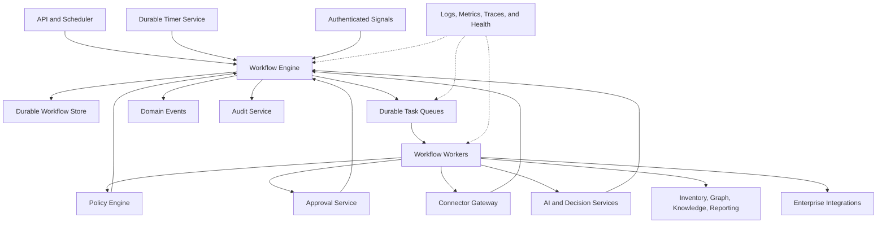
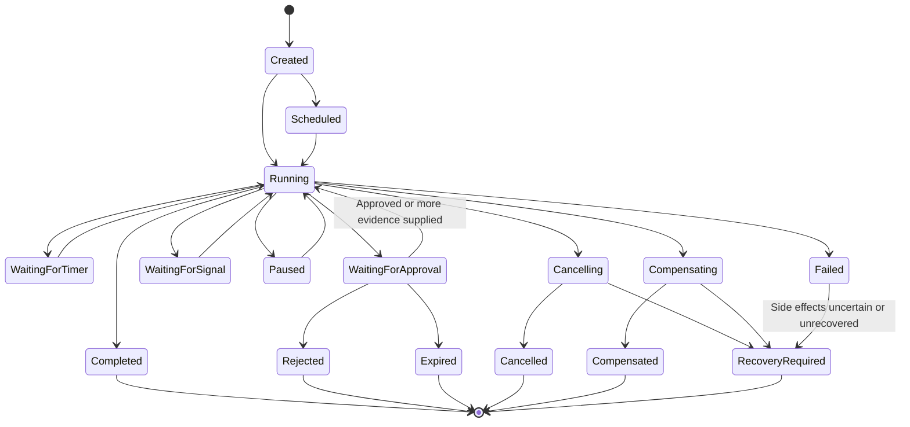

# Project Atlas

## Workflow Engine

| Field | Value |
| --- | --- |
| Document ID | ATLAS-023 |
| Version | 1.0.0 |
| Status | Approved |
| Document Owner | Workflow Platform Owner |
| Reviewers | Architecture Owner, Security Architecture, Infrastructure Operations, Backend Architecture, Audit Owner |
| Approver | Umit Ozdemir (acting Architecture Owner) |
| Approval Date | 2026-08-03 |
| Last Updated | 2026-08-03 |
| Related Documents | [ATLAS-003](003_Project_Principles.md), [ATLAS-010](010_System_Architecture.md), [ATLAS-011](011_Component_Architecture.md), [ATLAS-016](016_Event_Architecture.md), [ATLAS-025](025_Policy_Engine.md), [ATLAS-037](037_Approval_Workflow.md) |
| Supersedes | ATLAS-023 version 0.1.0 |

## 1. Purpose

This document defines how Project Atlas models, schedules, executes, pauses, resumes, retries, cancels, recovers, observes, and audits durable workflows.

The Workflow Engine coordinates authoritative components. It does not own their domain data, replace policy or approval, or grant AI execution authority.

## 2. Scope

### In Scope

- Workflow definition and run model
- State machine and step types
- Durability, scheduling, timers, retries, idempotency, and cancellation
- Policy, approval, connector, AI, and human-task integration
- Compensation, rollback, recovery, and partial completion
- Versioning, migration, concurrency, audit, observability, and testing
- MVP workflow scope

### Out of Scope

- Final workflow technology or definition language
- Domain algorithms executed inside steps
- Policy language details
- User-interface design for workflow views
- Direct infrastructure command implementation

## 3. Goals

- Make long-running operational work durable and inspectable
- Preserve state through process restart and dependency outage
- Apply authorization, policy, approval, and audit at required steps
- Prevent duplicate side effects
- Expose progress, waiting, partial, failed, cancelled, and recovery-required states
- Support scheduled health checks and on-demand investigations
- Keep workflow definitions versioned and testable
- Separate orchestration from domain component ownership

## 4. Workflow Model

| Entity | Meaning |
| --- | --- |
| Workflow definition | Immutable versioned process graph and contract |
| Workflow run | One execution instance bound to a definition version |
| Step definition | Versioned unit of coordination with input, output, policy, and failure rules |
| Step run | One logical execution of a step |
| Attempt | One try within a step run |
| Timer | Durable scheduled wake-up or deadline |
| Signal | Authenticated external input such as approval or cancellation |
| Checkpoint | Persisted workflow progress before or after a side effect |
| Compensation | Defined action that reverses a previously completed reversible step |
| Recovery task | Human or automated procedure when compensation is unavailable or unsafe |

## 5. Architecture

## 6. Workflow Definition

A definition declares:

- Stable identifier, semantic version, owner, and lifecycle
- Purpose and supported initiators
- Input and final output schemas
- Steps and allowed transitions
- Step input and output mappings
- Required roles, policies, capability classes, and approvals
- Timers, deadlines, retry, cancellation, and concurrency
- Compensation and recovery behavior
- Data classification and retention
- Events, audit records, and observability
- Compatibility and migration rules
- Required tests and runbooks

Definitions are reviewed artifacts. Runtime users cannot inject arbitrary code or connector commands into them.

## 7. Definition Lifecycle

- Draft
- Validating
- Review
- Approved
- Active
- Suspended
- Deprecated
- Retired

Only approved and active versions start new production runs. Existing runs remain bound to their version unless a reviewed migration occurs.

## 8. Workflow Run State

Terminal state does not always mean success. User interfaces and APIs expose the exact state.

## 9. Step Types

| Type | Purpose |
| --- | --- |
| Validation | Schema, precondition, freshness, and compatibility checks |
| Authorization | Scoped access decision from Identity and Access |
| Policy | Deterministic allow, deny, or conditional decision |
| Evidence query | Retrieve authorized inventory, graph, knowledge, or history |
| Connector capability | Invoke one registered governed capability |
| AI analysis | Run one bounded agent or model task |
| Decision | Produce findings, confidence, impact, or recommendation |
| Approval | Wait for an exact human decision packet |
| Human task | Request evidence, correction, or review without implying approval |
| Timer | Wait until a scheduled time, delay, or deadline |
| Notification | Deliver an informational message through an adapter |
| Integration | Create or update an authorized ITSM or external record |
| Report | Generate a versioned artifact asynchronously |
| Compensation | Reverse a completed reversible step |
| Recovery | Coordinate explicit recovery when rollback is not possible |

## 10. Step Contract

Each step declares:

- Stable step identifier and type
- Input and output schemas
- Authoritative executing component
- Deadline and timeout
- Retry owner and retry policy
- Idempotency behavior
- Cancellation behavior
- Required authorization, policy, and approval
- Expected side effects and capability class
- Success, failure, partial, and uncertain outcomes
- Evidence and audit requirements
- Compensation or recovery relation

## 11. Run Creation

Run creation validates:

- Active definition version
- Initiator identity and permission
- Input schema and target scope
- Environment and organization
- Idempotency key where applicable
- Scheduling permission
- Required configuration and component health

Creation returns a workflow identifier. Acceptance does not imply execution success.

## 12. Durability

- State is persisted before dispatching external side effects.
- Step result and next transition are recorded atomically where local storage permits.
- External results include idempotency and correlation identifiers.
- Worker ownership uses leases with expiry and heartbeat.
- Process restart resumes from persisted state, not memory.
- Timers survive restart.
- Workflow history is sufficient to explain transitions without relying only on logs.

## 13. Scheduling and Timers

Supported schedules may include:

- One-time future run
- Recurring interval
- Calendar schedule with explicit time zone
- Event-triggered run
- Manual run

Rules:

- Daylight-saving and missed-run behavior is declared.
- Duplicate scheduler delivery does not create duplicate logical runs.
- Catch-up is bounded.
- Schedule ownership, enablement, and change are audited.
- Target rate and maintenance windows are respected.

## 14. Retry

Retry policy declares:

- Retryable error categories
- Maximum attempts
- Initial delay, backoff, jitter, and maximum delay
- Total retry budget
- Idempotency requirement
- Behavior on deadline or cancellation

Exactly one layer owns automatic retry for a given operation. Workflow retry must account for client, gateway, connector, and vendor retries to prevent amplification.

## 15. Idempotency

An idempotency key binds to:

- Workflow definition and version
- Run or business request
- Step identifier
- Capability, connector instance, target, and input digest where applicable

Duplicate commands return or reconcile the existing logical outcome. C3 through C5 steps require target-specific evidence before retry after uncertain outcome.

## 16. Timeout and Deadline

- Workflow, step, and attempt deadlines are separate.
- Downstream deadlines are shorter than caller deadlines.
- Timeout is a state, not proof that target work stopped.
- Connector timeout can produce `OutcomeUncertain`.
- Timer expiration and approval expiration are deterministic events.
- Deadline changes after start require explicit policy and audit.

## 17. Cancellation

Cancellation is a request, not instantaneous erasure.

The engine:

1. Authenticates and authorizes the requester.
2. Marks the run `Cancelling`.
3. Stops dispatching new eligible steps.
4. Propagates cancellation to active components that support it.
5. Waits within a bounded period for outcomes.
6. Determines whether compensation or recovery is required.
7. Records final `Cancelled` or `RecoveryRequired` state.

Cancellation does not delete history, evidence, audit, or completed side effects.

## 18. Authorization and Delegation

- Run creation captures human initiator and current scope.
- Long-running work uses a bounded service delegation reference, not a raw user session.
- Sensitive steps re-evaluate authorization near execution time.
- Revocation behavior is declared by workflow type.
- A scheduler uses a named service identity and target scope.
- Workflow ownership does not grant permission to every target.

## 19. Policy Integration

Policy evaluation occurs:

- At run creation where applicable
- Before sensitive evidence access
- Before connector capability dispatch
- Before approval packet creation
- Immediately before future controlled execution
- When relevant context or proposal version changes

Policy results are versioned references. A conditional result creates explicit required steps; it is not treated as allow.

## 20. Approval Integration

An approval step binds:

- Proposal and plan version
- Exact action, capability, target, and parameters
- Evidence, impact, duration, and recovery references
- Required role and separation of duties
- Change record and window where required
- Expiry

Changed bound data invalidates approval and returns the workflow to analysis or approval preparation.

## 21. AI Integration

AI steps:

- Use versioned agent and prompt definitions
- Receive authorized evidence packages
- Have step, tool, token, time, and output budgets
- Return structured untrusted output
- Cannot mutate workflow state directly
- Cannot approve, skip, or add arbitrary execution steps

The engine validates AI output before transition.

## 22. Connector Integration

- The step names a registered capability, not an arbitrary command.
- Connector Gateway revalidates instance, target, class, policy, and approval.
- Invocation and attempt identifiers correlate with the step run.
- Partial and uncertain outcomes block dependent steps unless the definition handles them explicitly.
- Raw vendor errors do not become workflow expressions without normalization.

## 23. Human Tasks

Human tasks may request:

- Additional evidence
- Target confirmation
- Data correction
- Domain review
- Approval
- Manual recovery completion

Tasks declare assigned role, due time, permitted outcomes, required comment or evidence, and escalation. Ordinary review tasks do not imply approval.

## 24. Compensation, Rollback, and Recovery

### 24.1 Compensation

Compensation is a defined action that semantically reverses a prior completed step. It is not automatically available.

### 24.2 Rollback

Rollback returns a target to a known prior state and requires evidence that reversal is supported.

### 24.3 Recovery

Recovery restores an acceptable service state when exact reversal is impossible. Recovery may require human operations outside Atlas.

The workflow records which completed steps were compensated, remain active, or have uncertain state.

## 25. Failure Classification

- Validation failure
- Authorization or policy denial
- Approval rejection or expiry
- Dependency unavailable
- Retryable transient failure
- Permanent domain failure
- Timeout
- Cancellation
- Partial completion
- Outcome uncertain
- Compensation failed
- Recovery required
- Internal workflow failure

Failure categories drive declared transitions, not generic retry.

## 26. Concurrency and Target Locks

Workflows may use:

- Optimistic entity versions
- Target-scoped leases
- Capability-specific concurrency limits
- Maintenance-window locks
- Workflow uniqueness keys

Locks have owner, purpose, scope, acquisition time, expiry, renewal, and audit. An expired lock does not prove an external action ended.

## 27. Workflow Versioning

- New runs use the active version.
- Existing runs remain on their bound version.
- Compatible changes may add new paths not used by in-flight runs.
- Breaking changes require migration or continued runtime support.
- Definitions referenced by retained run history remain interpretable.
- Agent, prompt, policy, capability, and schema versions are bound or referenced per step.

## 28. Run Migration

Migration requires:

- Source and target definition versions
- Eligible states and checkpoints
- State and data transformation
- Completed side-effect analysis
- Policy, approval, and compatibility re-evaluation
- Dry run and rollback or recovery plan
- Human approval for sensitive migrations

Forced silent migration is prohibited.

## 29. Events

The engine emits ATLAS-016 events for run and significant step facts, including started, waiting, resumed, completed, failed, cancelled, compensating, and recovery-required.

Events do not replace authoritative workflow state. Event replay cannot repeat side effects without idempotent command handling.

## 30. Audit

Audit captures:

- Definition and schedule administration
- Run creation, initiator, target, and input summary
- Authorization, policy, and approval references
- Sensitive step dispatch and result
- Manual signals and human tasks
- Retry, cancellation, compensation, migration, and recovery
- Final state and unresolved effects

Secrets and prohibited input content are excluded.

## 31. Observability

Required signals:

- Runs by type and state
- Queue depth and oldest task
- Schedule delay
- Step duration and attempts
- Retry, timeout, cancellation, partial, and uncertain outcomes
- Approval wait age
- Stuck lease and timer lag
- Compensation and recovery-required rate
- Worker health and saturation
- Event and audit publication backlog

## 32. Data and Retention

Workflow data includes definition, run, step, attempt, timer, signal, decision references, evidence references, and history.

Retention considers audit, incident, change, approval, and support needs. Large connector outputs and reports use evidence or artifact references rather than inline workflow state.

## 33. Security

- Authenticated human and service initiators
- Scoped delegation
- Definition and schedule administration separation
- No arbitrary code or command steps
- Typed inputs and outputs
- Secret references only
- Target and environment binding
- Policy and approval revalidation
- Rate, concurrency, time, and resource limits
- Audit for sensitive transitions

## 34. Definition Validation

Validation detects:

- Unreachable and non-terminating paths
- Missing failure or timeout transitions
- Retry without idempotency
- Sensitive step without policy or approval
- Compensation reference cycles
- Missing input or output mapping
- Unbounded timers, loops, or parallel branches
- Incompatible capability, agent, or schema versions
- Secret fields in workflow data

## 35. Testing

- Definition and schema tests
- State-transition tests
- Scheduling and daylight-saving tests
- Duplicate command and idempotency tests
- Timeout, cancellation, and retry tests
- Policy, approval, and separation-of-duties tests
- Worker crash and lease recovery tests
- Partial, uncertain, compensation, and recovery tests
- Version migration tests
- Audit and event completeness tests
- Load and backpressure tests

## 36. MVP Workflows

Initial workflows:

1. Evidence-grounded infrastructure query
2. Scheduled read-only health check
3. Knowledge ingestion and publication
4. Connector package validation
5. Change impact analysis ending in an approval-ready packet
6. Report generation

MVP workflows do not execute C3 through C5 capabilities.

## 37. MVP Engine Scope

### Included

- Versioned definitions and durable runs
- Worker queues, leases, timers, retries, and cancellation
- Policy and approval wait steps
- Connector, AI, evidence, and report steps
- Idempotency and partial or uncertain outcomes
- Events, audit, metrics, and status API
- Definition validation and test harness

### Excluded

- Arbitrary user-authored production workflows
- C3 through C5 execution
- Cross-region active-active engine
- Unbounded dynamic DAG generation by AI
- Automatic compensation without defined safety evidence

## 38. Dependencies and Traceability

- ATLAS-010 through ATLAS-012 define system, component, and distributed boundaries.
- ATLAS-016 defines workflow lifecycle events.
- ATLAS-020 defines connector capability invocation.
- ATLAS-024 and ATLAS-025 define decision and policy steps.
- ATLAS-037 defines approval packets and human decisions.
- ATLAS-056 defines workflow testing requirements.
- ADR-134 establishes the initial code-owned definition registry and durable non-executable run-plan boundary.
- ADR-135 establishes durable plan cancellation and immutable transition-history boundaries.
- ADR-136 establishes digest-bound fenced orchestration leases without execution authority.
- ADR-137 establishes durable run and step-run materialization without attempt or dispatch authority.
- ADR-138 establishes durable root-step attempt materialization without queue, dispatch or execution
  authority.
- ADR-139 establishes durable dispatch-intent staging without broker publication, delivery,
  dispatch or execution authority.
- ADR-140 establishes atomic, provider-neutral pending-publication outbox evidence without broker
  publication, delivery, dispatch or execution authority.
- ADR-141 establishes bounded, independently fenced publisher ownership of an exact pending outbox
  entry without selecting a broker or granting publication, delivery, dispatch or execution
  authority.
- ADR-142 establishes one immutable canonical dispatch-event envelope under the exact active
  publication lease without transport selection, wire serialization, publication, delivery,
  dispatch or execution authority.
- ADR-143 establishes immutable policy-governed transport admission for the exact prepared event
  envelope without provider or route selection, wire serialization, publication, delivery,
  dispatch or execution authority.
- ADR-144 establishes deterministic provider-neutral UTF-8 canonical JSON byte-artifact
  materialization for the exact admitted event without exposing raw bytes to humans and without
  provider or route selection, publication, delivery, dispatch or execution authority.
- ADR-145 establishes immutable binding of the exact byte artifact to a code-owned logical
  publication channel contract without physical transport selection, credentials, network calls,
  publication, delivery, dispatch or execution authority.
- ADR-146 establishes an independently immutable deployment-owned physical transport capability
  profile snapshot without event lineage, compatibility admission, route binding, credentials,
  network calls, publication, delivery, dispatch or execution authority.
- ADR-147 establishes immutable policy-governed compatibility admission between one exact logical
  channel binding and one exact deployment transport profile snapshot without route selection,
  credentials, network calls, publication, delivery, dispatch or execution authority.
- ADR-148 establishes an independently immutable deployment-owned physical transport route
  snapshot using opaque route references and versioned security requirements, without workflow
  binding, credential selection, network calls, readiness claims, publication, delivery, dispatch
  or execution authority.
- ADR-149 establishes one minimal immutable binding across the exact logical channel,
  compatibility admission, transport profile snapshot and physical route snapshot. It copies no
  route metadata and grants no resolver, credential, network, readiness, publication, delivery,
  dispatch or execution authority.
- ADR-150 establishes a bounded immutable freshness and non-supersession admission for the exact
  physical binding and route snapshot against the authoritative unique current-selection head. It
  records monotonic generation and fencing evidence, requires later resolver revalidation and
  grants no endpoint-resolution, credential, network, readiness, publication, delivery, dispatch
  or execution authority.
- ADR-151 establishes one non-transferable, 15-second endpoint-resolution authorization lease for
  the exact resolver workload after database-time revalidation of the complete physical route and
  freshness chain. It contains no endpoint or credential material, grants only endpoint-resolution
  authority and requires a later materializer to consume it once under the crash-safe semantics
  clarified by ADR-152.
- ADR-152 establishes irreversible single-use lease consumption before one trusted protected
  endpoint-materialization attempt. Claim and attempt commit before the adapter call; success,
  known failure and uncertainty remain append-only, raw coordinates stay outside ordinary
  persistence and all post-materialization authority declarations are false.
- ADR-153 establishes an independently immutable deployment-owned physical-transport credential-
  assignment snapshot. It proves exact route requirement, credential profile, authentication,
  principal, least-privilege and rotation lineage without workflow binding, secret access,
  network calls or any operational authority. Scope-based immutable history survives source
  rotation; exact replay resolves before current-source validation, while completion audit reports
  creation only after the atomic snapshot and claim commit. The deployment registry treats the
  highest unique rotation/generation revision as head, so a newer inactive or revoked record
  supersedes earlier active history without mutable rows.
- ADR-154 establishes an immutable workflow physical-transport credential-assignment binding
  between one exact route binding, its exact route snapshot and one compatible assignment
  snapshot. Different credential generations may remain as append-only history for a route
  binding, but this boundary grants no credential or protected-artifact access and makes no
  current-head, expiry or revocation decision. A later freshness admission must independently
  prove those properties before credential-access authorization.
- ADR-155 establishes a bounded immutable freshness admission for one exact workflow credential-
  assignment binding and assignment snapshot against the append-only deployment registry's unique
  highest rotation/generation head. It requires active, unexpired and unrevoked lifecycle state,
  uses assignment-scoped fencing and database time, and grants no credential access, brokerage,
  secret delivery, network, publication, delivery, dispatch or execution authority.
- ADR-156 establishes one non-transferable, 15-second credential-access authorization lease for
  the exact dedicated accessor workload after database-time revalidation of the complete
  credential-assignment freshness chain. It grants only a future single-use credential-access
  attempt and performs no secret resolution, brokerage, protected-artifact access, endpoint
  access, delivery, network operation, dispatch or execution.
- ADR-157 establishes irreversible single-use credential-access lease consumption before one
  trusted protected credential-materialization attempt. Claim and attempt commit before the
  protected adapter call; success, known failure and uncertainty remain append-only, raw
  credentials stay outside ordinary persistence and all post-materialization authority
  declarations are false.
- ADR-158 establishes one immutable target-context binding across an exact successful endpoint
  materialization result and credential materialization result after proving their complete shared
  physical-route and assignment lineage. It opens neither artifact, records only the bounded
  overlap observation and grants no artifact access, credential delivery, network, readiness,
  publication, dispatch or execution authority.
- ADR-159 establishes one append-only, single-use and exact five-second target-context access-
  authorization lease for the dedicated accessor workload. Two trusted metadata-only protected-
  store attestations are acquired before the database transaction; the transaction then
  revalidates pending-outbox liveness, current route and credential-assignment heads and fences,
  canonical lineage and the full window without depending on orchestration or publication leases.
  Only protected-artifact access is authorized; consumption, artifact opening, credential
  delivery, endpoint reveal and every network or runtime authority remain separate boundaries.
- ADR-160 establishes irreversible single-use consumption of that exact lease before one trusted
  paired-artifact opener is called. Fresh signed endpoint and credential status/openability
  attestations are obtained outside the transaction; PostgreSQL then revalidates the complete
  current chain and atomically commits one append-only claim and started attempt as the point of no
  return. The trusted boundary opens only the exact pair and may produce one sealed, short-lived
  target-context capsule lineage. Raw values never enter ordinary platform layers, claim-only
  uncertainty is never retried, all 17 outcome authority fields are false, and capsule identity
  grants no endpoint reveal, credential delivery, network or runtime authority.
- ADR-161 establishes one immutable append-only consumer binding from an exact successful ADR-160
  opening result to a server-derived future consumer workload, versioned contract, code-owned
  purpose and exact pending outbox/event lineage. Only the dedicated binder workload and audience
  may submit the opening-result ID and digest, policy ID and version, and idempotency metadata.
  PostgreSQL revalidates `opened_protected`, confirmed cleanup, non-bearer capsule status and
  deadline, the complete target-context lineage, pending-outbox liveness, and authoritative current
  route and credential-assignment heads before appending the unique binding. Exact replay is stable
  and side-effect free; changed or competing binding fails closed. The boundary makes no protected-
  store, opener, broker or network call, all 17 authority fields remain false, and capsule handoff
  authorization, unsealing, delivery, runtime, dispatch, execution and mutation are deferred.
- ADR-162 establishes one append-only, single-use, non-renewable and non-transferable one-second
  handoff-authorization lease for the exact consumer workload bound by ADR-161. A fresh signed,
  nonce-bound metadata-only capsule lifecycle attestation is captured before the transaction.
  PostgreSQL revalidates the complete target-context, opening, binding, event, route and
  credential-assignment lineage, current heads and fences and the full lease window before
  atomically appending the lease, idempotency claim and audit evidence. Only the dedicated
  `target_context_capsule_handoff_authorized` declaration is true; all existing 17 operational
  authority declarations remain false. Capsule retrieval, handoff consumption, unsealing,
  delivery, network, runtime, dispatch, execution and mutation remain separate later boundaries.
- ADR-163 irreversibly consumes that exact lease by atomically committing one append-only claim
  and started attempt before any trusted adapter call. The adapter may hand the still-sealed
  capsule only to the exact ADR-161 consumer protected boundary and returns only a signed,
  minimized, non-bearer receipt. Claim-only or uncertain outcomes are never retried, the dedicated
  handoff field and all 17 operational authority fields are false on claim, attempt and result,
  and unsealing, runtime, dispatch, execution and infrastructure mutation remain separately
  authorized future boundaries.
- ADR-164 establishes one append-only, single-use, non-renewable, non-transferable and non-bearer
  one-second opening-authorization lease from one canonical `handed_off_sealed` result. Only the
  exact consumer workload may request its own lease. Fresh signed destination custody/lifecycle
  evidence must bind the complete receipt, destination, generation, fence and custody lineage and
  prove both destination custody finality and terminated source reuse authority without requiring
  source-side physical deletion. Exact replay obtains fresh evidence and repeats all currentness
  checks under PostgreSQL locks. Only `target_context_capsule_opening_authorized` is true; the
  handoff field and all 17 operational authority fields are false. Retrieval, unsealing,
  decryption, runtime, network, dispatch, execution and mutation remain deferred to separately
  authorized future boundaries, beginning with IMP-215 consumption.

## 39. Assumptions

- Workflows may run longer than user sessions and process lifetimes.
- External systems may return delayed, duplicate, partial, or uncertain outcomes.
- The first workflows are read-only or analytical.
- A durable workflow technology can run in restricted enterprise environments.

## 40. Open Questions and ADR Backlog

- Which workflow technology and definition format are selected?
- Which persistence and task-queue technologies support restricted deployment?
- Which definition features are code-only versus declarative?
- What retention applies to workflow history and evidence references?
- Which steps require synchronous audit persistence?
- How are target locks coordinated across connector instances?

## 41. Acceptance Criteria

This document is ready to enter Review when:

- Definition, run, step, attempt, timer, signal, and state contracts are agreed.
- Retry, idempotency, timeout, cancellation, and uncertain outcomes are enforceable.
- Authorization, policy, approval, AI, and connector boundaries remain authoritative.
- Compensation, rollback, recovery, versioning, and migration rules are complete.
- Initial workflows and MVP exclusions align with ATLAS-002 and ATLAS-003.
- Workflow technology and persistence ADRs have owners.

## 42. Change History

| Version | Date | Author | Summary |
| --- | --- | --- | --- |
| 0.1.0 | 2026-07-21 | Project Atlas Team | Initial workflow types, requirements, and states |
| 0.2.0 | 2026-08-03 | Workflow Platform Owner | Added durable workflow model, state machine, step contracts, retries, idempotency, cancellation, policy, approval, compensation, migration, and MVP workflows |
| 1.0.0 | 2026-08-03 | Umit Ozdemir | Approved as the first binding documentation baseline under the designated approver authority |
| 1.1.0 | 2026-08-15 | Workflow Architecture | Added atomic single-use target-context artifact opening and sealed zero-authority capsule lineage |
| 1.2.0 | 2026-08-16 | Workflow Architecture | Added immutable zero-authority target-context capsule consumer binding |
| 1.3.0 | 2026-08-16 | Workflow Architecture | Added bounded single-use target-context capsule handoff-authorization lease |
| 1.4.0 | 2026-08-16 | Workflow Architecture | Added atomic lease consumption and sealed protected-boundary capsule handoff |
| 1.5.0 | 2026-08-16 | Workflow Architecture | Added bounded consumer-side target-context capsule opening-authorization lease |
